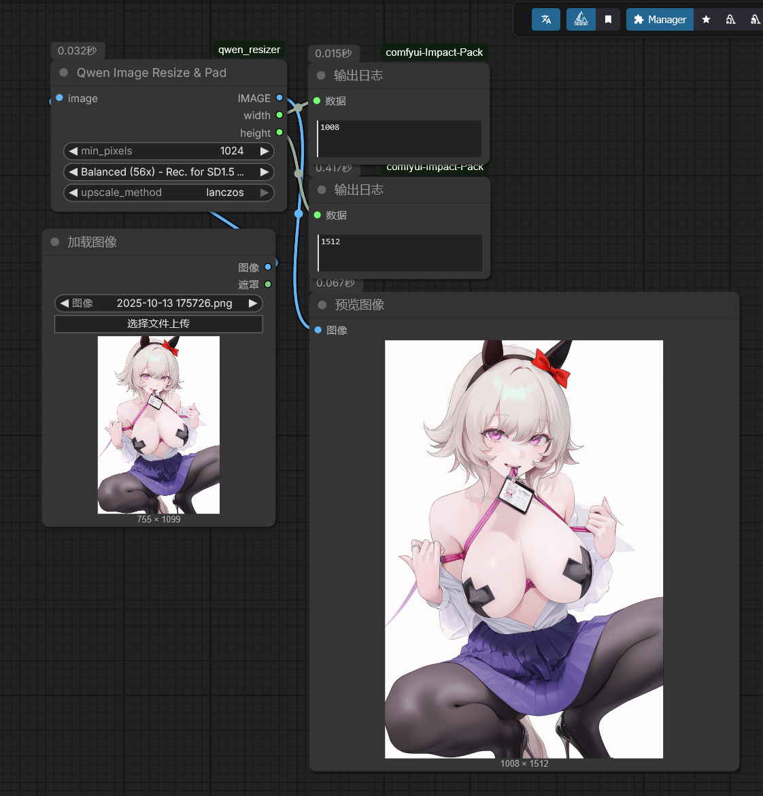

# qwen_resizer
这是一个用于将输入图像缩放成适合qwen-image-edit模型使用分辨率的ComfyUI节点。由于ComfyUI的qwen-image-edit默认工作流中是将原本用于flux kontext的预处理缩放节点用在了qwen-image-edit中，导致图像被错误缩放成了flux1所需要的大小从而造成qwen-image-edit图像的生成质量下降，因此我尝试将其缩放为qwen预处理需要的大小（图像宽高均为28的倍数）来尝试提升最终生成质量。

This is a ComfyUI node designed to scale input images to resolutions suitable for the qwen-image-edit model. In ComfyUI's default workflow for qwen-image-edit, the preprocessing scaling node originally intended for flux kontext was incorrectly applied to qwen-image-edit, causing images to be scaled to the size required by flux1 and thus reducing the quality of the final output. To address this, I have modified it to scale images to the size required by qwen preprocessing—where both the width and height are multiples of 28—in an attempt to improve the quality of the generated images.

下方是示例工作流，
其中min_pixels（缩放后最小边像素不低于这个值）：1024（视情况灵活调节）
缩放模式：默认选择Balanced（56x）即将图像宽高缩放为56的倍数即可（因为Qwen-edit需要的图像大小为28的倍数，而ComfyUI要求图像必须为4\8\16\32的倍数，而56是8和28的最小公约数，正好能同时满足两个的要求）（当然你们也可以尝试其他的公倍数模式）
upscale_method（放大方法）：lanczos（推荐）
在图像缩放后将其输入到对应的qwen-image-edit图像参考输入端口即可。

Below is an example workflow:

- **min_pixels** (the shorter side after scaling should not fall below this value): 1024 (adjust flexibly as needed).
- **Scaling mode**: By default, select **Balanced (56x)**, which scales the image width and height to multiples of 56. This is because Qwen-edit requires image dimensions to be multiples of 28, while ComfyUI requires them to be multiples of 4, 8, 16, or 32. Since 56 is the least common multiple of 8 and 28, it satisfies both requirements simultaneously (of course, you may also try other common multiple modes).
- **upscale_method** (upscaling method): **lanczos** (recommended).

After scaling the image, connect it to the corresponding qwen-image-edit image reference input port.

